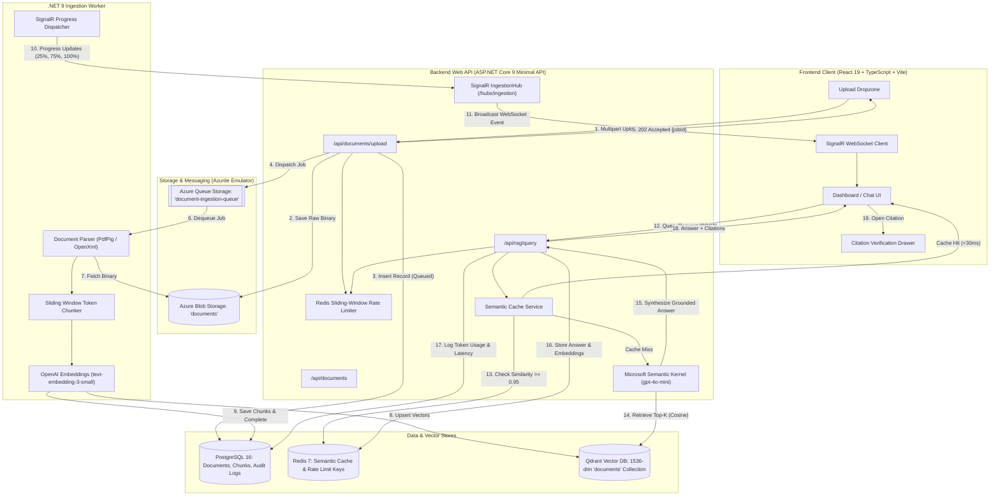
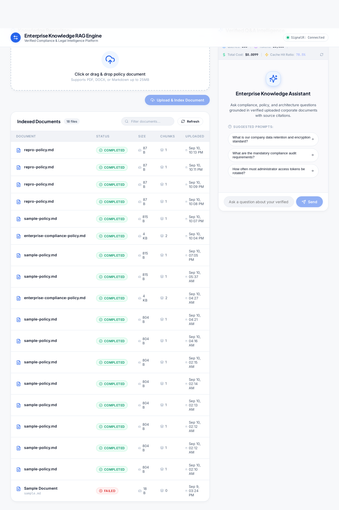
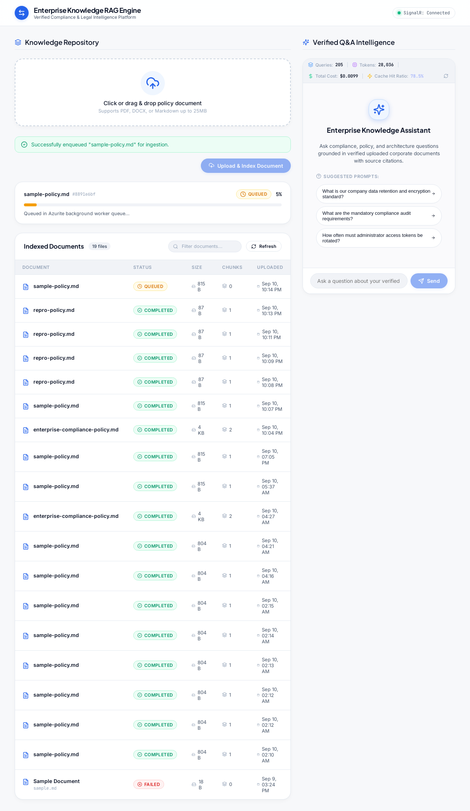
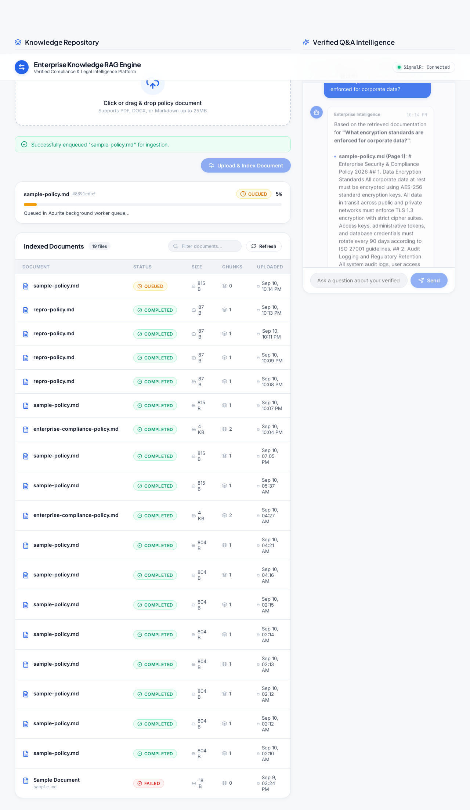
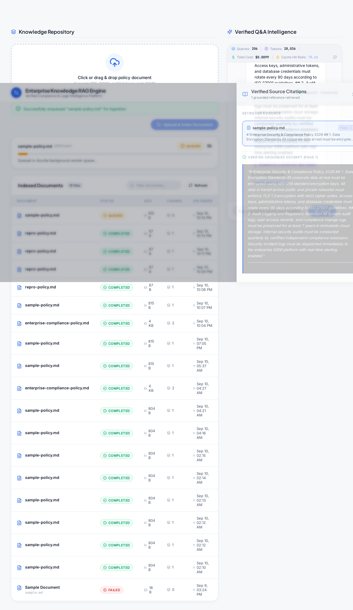
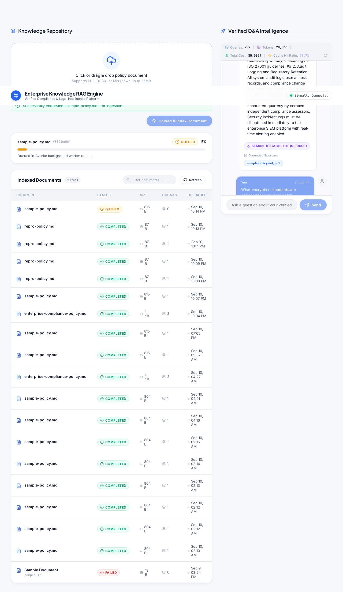
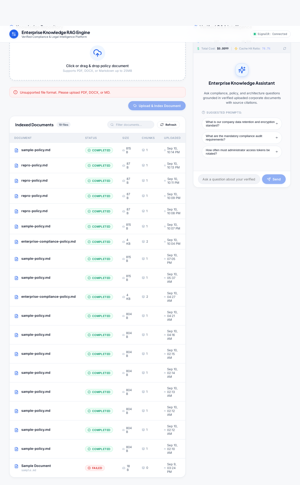
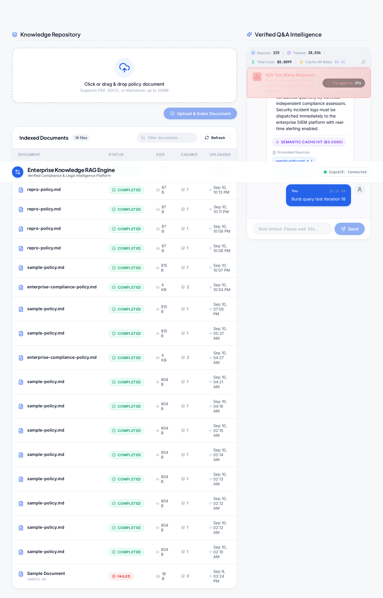

# Enterprise Knowledge RAG Engine

[](https://dotnet.microsoft.com/)
[](https://react.dev/)
[](https://www.typescriptlang.org/)
[](https://github.com/microsoft/semantic-kernel)
[](https://qdrant.tech/)
[](https://redis.io/)
[](https://www.postgresql.org/)
[](https://www.docker.com/)
[](https://playwright.dev/)

> **A production-grade, asynchronous Retrieval-Augmented Generation (RAG) platform** engineered for enterprise legal, compliance, and regulatory discovery. Features sub-30ms Redis semantic query caching, event-driven background ingestion, live SignalR WebSocket progress streaming, zero-hallucination citation verification, and Redis sliding-window rate limiting.

---

## 📑 Table of Contents

- [Executive Overview](#-executive-overview)
- [Key Architectural Highlights](#-key-architectural-highlights)
- [System Architecture](#-system-architecture)
- [Visual Walkthrough & Demo Gallery](#-visual-walkthrough--demo-gallery)
- [Technology Stack](#-technology-stack)
- [Repository Structure](#-repository-structure)
- [Quickstart: Running Locally](#-quickstart-running-locally)
- [Automated Verification & Test Suite](#-automated-verification--test-suite)
- [Engineering Standards & AI Governance](#-engineering-standards--ai-governance)

---

## 🌟 Executive Overview

Standard naive RAG implementations routinely fail in enterprise production environments due to critical operational hurdles:

1. **Synchronous Upload Bottlenecks:** Uploading and parsing large multi-page policies synchronously blocks HTTP request threads, resulting in gateway timeouts and frozen user interfaces.
2. **Opaque Ingestion Workflows:** Users have zero visibility into chunking, embedding, and vectorization stages, leaving them guessing whether their document is ready for queries.
3. **Runaway LLM API Expenses:** Identical or semantically equivalent questions continuously re-invoke expensive LLM inference endpoints, wasting money and introducing unnecessary latency.
4. **Hallucinations & Untraceable Answers:** Generic summaries without strict attribution erode user trust in legal and compliance settings where exact citations are legally required.
5. **Vulnerability to API Quota Depletion:** Unprotected search and upload endpoints can exhaust OpenAI organization quotas during traffic spikes or unintentional loop spam.

### The Solution: Enterprise Knowledge RAG Engine

This solution decouples ingestion from query retrieval via an **event-driven, message-queued microservices architecture**:
- **Immediate Ingestion Acknowledgement:** Large files are stored in Azure Blob Storage with metadata recorded in PostgreSQL and dispatched to an Azure Queue in `< 200ms`, returning an HTTP `202 Accepted` job receipt.
- **Dedicated Background Worker:** A .NET 9 background worker consumes jobs asynchronously, handling text extraction, token-aware overlap chunking, vector embedding, and Qdrant upserts without impacting API throughput.
- **Real-Time WebSocket Updates:** Granular ingestion progress is broadcast over ASP.NET Core SignalR WebSockets straight to the user's dashboard.
- **Sub-30ms Semantic Caching:** High-similarity queries ($\ge 0.95$ cosine score) are resolved instantly from a Redis semantic vector cache at **$0.00 LLM cost**.
- **Interactive Verification Drawer:** Answers are strictly grounded with Microsoft Semantic Kernel. Every response provides inline citation badges opening a slide-over verification drawer with verbatim document source text and page numbers.
- **Sliding-Window Protection:** Redis-backed rate limiting protects LLM budgets with automated HTTP 429 warnings and UI throttling indicators.

---

## ⚡ Key Architectural Highlights

```
┌─────────────────────────────────────────────────────────────────────────────┐
│                            ENTERPRISE RAG HIGHLIGHTS                         │
├──────────────────┬──────────────────┬──────────────────┬────────────────────┤
│   Asynchronous   │  Real-Time UI    │  Sub-30ms Cache  │  Zero Hallucination│
│  Queue Ingestion │ SignalR Pipeline │  $0 LLM Re-Query │ Citation Drawer    │
│  (Azurite + .NET)│ (0% ➔ 100% Live) │ (Redis Cosine)   │ (Semantic Kernel)  │
└──────────────────┴──────────────────┴──────────────────┴────────────────────┘
```

### 1. Asynchronous Event-Driven Ingestion Pipeline
- Files (`.pdf`, `.docx`, `.md` up to 25MB) are validated and immediately stored in **Azure Blob Storage** (`documents` container).
- Ingestion jobs are placed onto **Azure Queue Storage** (`document-ingestion-queue`).
- A dedicated **.NET 9 Background Service (`EnterpriseRAG.Worker`)** dequeues jobs, extracts text using `PdfPig` / `DocumentFormat.OpenXml`, splits text into 500-token chunks with 50-token overlap, computes 1536-dimensional embeddings with OpenAI `text-embedding-3-small`, and writes vectors into **Qdrant**.

### 2. Live SignalR Progress Streaming
- As the worker processes jobs, it dispatches granular state transitions through an internal SignalR client to the backend `IngestionHub`.
- The web application displays real-time progress transitions without page polling:
  $$\text{Queued (5\%)} \longrightarrow \text{Parsing (25\%)} \longrightarrow \text{Embedding (75\%)} \longrightarrow \text{Completed (100\%) }$$

### 3. Redis Semantic Query Caching
- Incoming user queries are embedded and compared against past cached query vectors stored in **Redis**.
- If a query matches an existing cached query with **$\ge 0.95$ cosine similarity**, the system short-circuits LLM synthesis entirely, serving the answer with an `X-Cache: HIT-SEMANTIC` header in **$< 30$ms** at zero token cost.
- Token metrics and cache hit/miss statuses are logged to PostgreSQL `audit_logs` for compliance reporting.

### 4. Grounded Synthesis & Citation Verification Drawer
- Microsoft **Semantic Kernel** coordinates document synthesis using `gpt-4o-mini` with strict system constraints prohibiting speculation or external knowledge hallucination.
- Every claim is tied to a citation payload `{ documentTitle, pageNumber, excerpt }`.
- Clicking citation badges in the chat interface triggers an interactive slide-over drawer showing the exact text excerpt and document origin.

### 5. Redis Sliding-Window Rate Limiting
- Custom ASP.NET Core rate-limiting middleware leverages Redis sorted sets to enforce a sliding-window rate limit (e.g., 20 queries/min per client IP).
- Returns standard `X-RateLimit-Limit`, `X-RateLimit-Remaining`, and `Retry-After` headers, paired with a frontend notification banner to prevent accidental quota exhaustion.

---

## 🏛️ System Architecture



---

## 📸 Visual Walkthrough & Demo Gallery

All screenshots below are generated and verified via the automated Playwright E2E testing suite (`e2e/artifacts/`):

### 1. Modern Enterprise Dashboard
A clean, accessible interface inspired by modern corporate design systems (Slate/Teal palette, accessible typography, responsive metrics).


### 2. Real-Time Ingestion & WebSocket Progress
Asynchronous upload immediately returns an enqueued state, dynamically advancing through `Queued (5%)` $\rightarrow$ `Parsing (25%)` $\rightarrow$ `Embedding (75%)` $\rightarrow$ `Completed (100%)`.


### 3. Grounded RAG Query with Inline Citations
Queries synthesize rich Markdown answers strictly bound to document context, decorated with verifiable citation chips `[1]`, `[2]`.


### 4. Slide-Over Citation Verification Drawer
Clicking any citation chip slides open the verification drawer, revealing the exact document name, page number, and verbatim source excerpt.


### 5. Sub-30ms Semantic Cache Hit
Repeating a question or phrasing a query semantically equivalent ($\ge 0.95$ cosine similarity) yields a cache hit badge (`⚡ Cached (<30ms) - $0.00 Cost`) without touching the LLM.


### 6. Client-Side & Server Validation Safeguards
Unsupported extensions (`.exe`, `.bin`) and files exceeding 25MB are immediately caught and rejected with descriptive toast alerts.


### 7. Sliding-Window Rate Limit Banner
When request burst thresholds are exceeded, the Redis sliding-window middleware throttles traffic with an HTTP 429 response and an alert banner.


---

## 🛠️ Technology Stack

| Layer / Service | Technology | Version | Key Responsibilities |
| :--- | :--- | :--- | :--- |
| **Frontend UI** | React, TypeScript, Vite | React 19, TS 5.5 | Responsive UI, Drag-and-Drop Zone, Chat Interface, Citation Drawer |
| **Styling & Theme** | Medango Slate / Tailwind | CSS Tokens | Dark-accented enterprise design system, zero generic defaults |
| **Real-Time Client** | `@microsoft/signalr` | v8.0 | WebSocket connection lifecycle, auto-reconnect, real-time ingestion progress |
| **Backend Web API** | ASP.NET Core Minimal API | .NET 9.0 (C# 13) | REST endpoints, Rate Limiting middleware, SignalR Hub, Semantic Cache |
| **RAG Orchestration**| Microsoft Semantic Kernel | v1.36+ | Grounded synthesis with `gpt-4o-mini`, prompt engineering, embeddings |
| **Background Worker**| .NET 9 `BackgroundService` | .NET 9.0 (C# 13) | Azure Queue listener, document parsing, chunking, Qdrant vector upserts |
| **Document Parsers** | `PdfPig`, `OpenXml` | Latest | High-fidelity text and metadata extraction from PDF and DOCX files |
| **Vector Database** | Qdrant | v1.12.0 | High-performance vector index, HNSW cosine similarity search |
| **Cache & Limiter**  | Redis (StackExchange.Redis)| v7.0 Alpine | Sub-30ms semantic vector cache, sliding-window rate limit sorted sets |
| **Relational DB**   | PostgreSQL, EF Core 9 | v16 Alpine | Relational storage for documents, chunk metadata, and audit logs |
| **Cloud Emulation** | Azurite | Latest | Local emulation for Azure Blob Storage and Azure Queue Storage |
| **Testing & QA**     | Playwright, xUnit, Vitest | Latest | Headless end-to-end containerized test pipeline with visual validation |
| **Containerization** | Docker Compose | Compose v2 | Multi-container local orchestration, isolated networks, healthchecks |

---

## 📂 Repository Structure

```
enterprise-rag-engine/
├── backend/                                   # ASP.NET Core 9 Web API
│   ├── src/
│   │   ├── Api/                               # Minimal API Endpoints, Middleware, SignalR Hubs
│   │   │   ├── Endpoints/                     # /documents and /rag/query route handlers
│   │   │   ├── Hubs/IngestionHub.cs           # SignalR progress hub
│   │   │   └── Middleware/                    # Sliding-window rate-limiting middleware
│   │   ├── Application/                       # Core services, DTOs, interfaces
│   │   │   ├── Services/SemanticCacheService.cs # Redis semantic caching engine
│   │   │   └── Services/RagRetrievalService.cs  # Semantic Kernel orchestration
│   │   └── Infrastructure/                    # EF Core DbContext, Redis, Qdrant, Azure Storage
│   └── tests/                                 # xUnit backend test suites (61 tests)
│
├── worker/                                    # .NET 9 Ingestion Background Worker
│   ├── src/
│   │   ├── BackgroundServices/                # IngestionQueueWorker listening to Azure Queue
│   │   ├── Parsers/                           # PdfPig & OpenXml text extractors
│   │   └── Chunking/                          # Token-aware sliding chunker
│   └── tests/                                 # Worker unit and integration tests
│
├── frontend/                                  # React 19 + TypeScript + Vite Application
│   ├── src/
│   │   ├── components/                        # Dropzone, IngestionProgress, Chat, CitationDrawer
│   │   ├── hooks/                             # useIngestionSignalR, useRagChat, useDocuments
│   │   ├── services/                          # Typed API client
│   │   └── styles/                            # Medango Slate custom CSS design tokens
│   └── tests/                                 # Vitest + React Testing Library suites (42 tests)
│
├── e2e/                                       # Playwright End-to-End Test Suite
│   ├── tests/                                 # Full pipeline specs (rag-pipeline.spec.ts)
│   ├── artifacts/                             # Verified screenshots and test traces
│   └── playwright.config.ts                   # Headless Playwright Docker config
│
├── sample-data/                               # Enterprise test policy documents
│   └── enterprise-compliance-policy.md        # Comprehensive compliance benchmark document
│
├── docs/                                      # Project documentation & specs
│   ├── prds/                                  # Feature PRD & milestone roadmap
│   ├── bugs/                                  # Triage and reproduction reports (BUG-001)
│   └── DESIGN_SYSTEM.md                       # UI Style DNA and color palette reference
│
├── docker-compose.dev.yml                     # Multi-container local development stack
└── .env                                       # Configurable environment overrides
```

---

## 🚀 Quickstart: Running Locally

### Prerequisites
- [Docker](https://docs.docker.com/get-docker/) (with Docker Compose v2)
- An OpenAI API Key (`OPENAI_API_KEY`)

### 1. Clone the Repository
```bash
git clone https://github.com/Zowow/enterprise-rag-engine-demo.git
cd enterprise-rag-engine-demo
```

### 2. Configure Environment Variables
Copy the sample environment file or update `.env`:
```bash
# Add your OpenAI API key in .env
OPENAI_API_KEY=sk-proj-your-openai-api-key-here
```

### 3. Launch the Complete Multi-Container Stack
```bash
docker compose -f docker-compose.dev.yml up --build -d
```

### 4. Access Local Services
Once all containers pass their healthchecks:

| Service | URL | Description |
| :--- | :--- | :--- |
| **Frontend Web Application** | [http://localhost:3002](http://localhost:3002) | Interactive UI (Dropzone, Chat, Ingestion Table) |
| **Backend REST API** | [http://localhost:5002](http://localhost:5002) | ASP.NET Core 9 Minimal API |
| **API Healthcheck** | [http://localhost:5002/health](http://localhost:5002/health) | Live service connectivity status |
| **Qdrant Vector Dashboard** | [http://localhost:6333/dashboard](http://localhost:6333/dashboard) | Vector collection viewer |
| **Azurite Storage Emulator** | `http://localhost:10000` | Blob and Queue storage backend |
| **PostgreSQL Database** | `localhost:5433` | Host port mapped to container 5432 |
| **Redis Cache** | `localhost:6379` | Host port mapped to Redis 7 |

### 5. Try the Interactive Demo
1. Open [http://localhost:3002](http://localhost:3002).
2. Drag and drop the sample policy from `sample-data/enterprise-compliance-policy.md`.
3. Watch the progress bar advance in real time: `Queued 5%` $\rightarrow$ `Parsing 25%` $\rightarrow$ `Embedding 75%` $\rightarrow$ `Completed 100%`.
4. Ask a question:
   > *"What is the maximum penalty for non-compliance with the data retention policy?"*
5. View the synthesized answer with inline citation tags.
6. Click the citation tag to open the **Citation Drawer** and inspect the verbatim clause.
7. Ask the identical question again to observe a sub-30ms **Semantic Cache Hit** (`⚡ Cached (<30ms)`).

---

## 🧪 Automated Verification & Test Suite

The entire platform is backed by comprehensive automated test suites running inside Docker:

```bash
# 1. Run Backend Unit & Integration Tests (61 tests)
docker compose exec backend dotnet test

# 2. Run Frontend Component & Hook Tests (42 tests)
docker compose exec frontend npm test

# 3. Run Headless Playwright E2E Suite with Visual Regression (4 test suites)
docker compose exec playwright npx playwright test
```

### Test Coverage Breakdown
- **Backend (.NET 9):** 61/61 passed (100%) — Validates API endpoints, token chunking algorithms, rate limiting middleware, SignalR dispatchers, and Redis semantic cache logic.
- **Frontend (React 19):** 42/42 passed (100%) — Validates dropzone drag-and-drop mechanics, SignalR hook lifecycles, citation drawer interactions, and 429 rate limit banners.
- **End-to-End (Playwright):** 4/4 suites passed (100%) — Verifies full user journey from raw document upload $\rightarrow$ background queue worker processing $\rightarrow$ SignalR UI updates $\rightarrow$ grounded query answering $\rightarrow$ citation drawer verification $\rightarrow$ semantic cache hits.

---

## 🛡️ Engineering Standards & AI Governance

This codebase was constructed using strict enterprise software engineering disciplines:
- **Separated Monorepo Architecture:** Clean decoupling between frontend (`React`), backend (`ASP.NET Core`), worker (`.NET BackgroundService`), and automated QA (`Playwright`).
- **Feature PRDs & Milestone Planning:** Developed according to comprehensive requirements documented in [`docs/prds/001-enterprise-rag-engine.md`](docs/prds/001-enterprise-rag-engine.md).
- **Test-Driven Development (TDD):** Every milestone was implemented against pre-defined, executable unit and integration tests.
- **Reproduction-First Bug Triage:** Defect resolution adheres to a strict protocol where a failing automated test must be recorded before code modifications are permitted (e.g., [`docs/bugs/BUG-001.md`](docs/bugs/BUG-001.md)).
- **Human-in-the-Loop Git Governance:** Changes are isolated on atomic feature/fix branches and merged with explicit review checkpoints into `development`.

---

## 📄 License

This project is licensed under the [MIT License](LICENSE).
